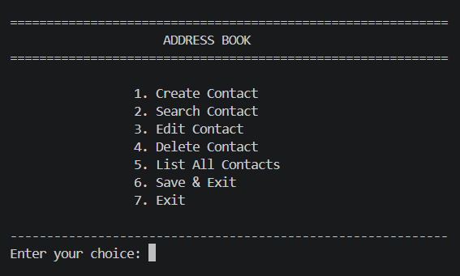
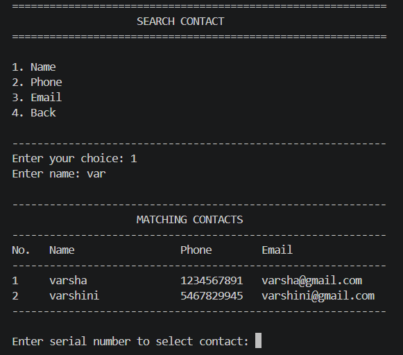
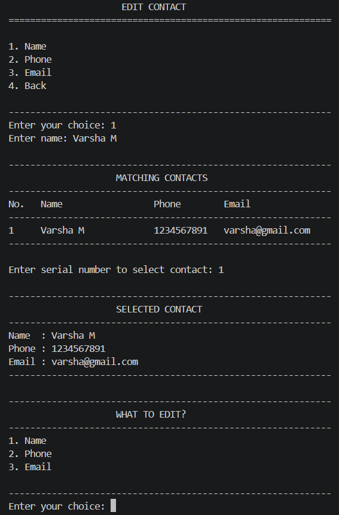

# 📒 Address Book Management System

A console-based Address Book Management System developed using C programming.

This project allows users to create, search, edit, delete, and list contacts. It also supports sorting contacts and storing contact information permanently using file handling.

---

## ✨ Features

- ➕ Create new contacts
- 🔍 Search contacts by name, phone number, or email
- 🔤 Search names using partial matching
- ✏️ Edit existing contacts
- 🗑️ Delete contacts with confirmation
- 📋 List all contacts
- 🔃 Sort contacts by name, phone number, or email
- ✅ Validate name, phone number, and email
- 🚫 Prevent duplicate phone numbers and email addresses
- 💾 Save contacts to a file
- 📂 Load contacts automatically when the program starts
- 🖥️ Clean and user-friendly console interface

---

## 🛠️ Technologies Used

- C Programming
- Structures
- Functions
- Pointers
- Arrays
- String Handling
- File Handling
- Input Validation
- Menu-driven Programming
- Bubble Sort

---

## 📁 Project Structure

- `main.c` — Main menu and program control
- `contact.c` — Contact operations and validation
- `contact.h` — Contact structures and function declarations
- `file.c` — File saving and loading
- `file.h` — File handling declarations
- `contacts.txt` — Stored contact information
- `README.md` — Project documentation

---

## ▶️ How to Run

### 1. Clone the repository

`git clone https://github.com/varsha1907-m/Address-Book.git`

`cd Address-Book`

### 2. Compile the program

`gcc main.c contact.c file.c -o addressbook`

### 3. Run the program

`./addressbook`

### 4. Use the menu

1. Create a contact
2. Search a contact
3. Edit a contact
4. Delete a contact
5. List all contacts
6. Save and Exit
7. Exit

---

## 📚 Concepts Used

- Structures
- Pointers
- Functions
- Arrays
- Strings
- File Handling
- Input Validation
- Menu-driven Programming
- String Comparison
- String Manipulation
- Bubble Sort

---

## 🎯 Project Objective

The objective of this project is to develop a simple and efficient console-based Address Book application using C programming concepts such as structures, pointers, functions, strings, sorting, and file handling.

---

## 📸 Screenshots

Screenshots of the working Address Book application are shown below.

### 🏠 Main Menu

### 🔍 Search Contact

### ✏️ Edit Contact

### 🗑️ Delete Contact

*Screenshot will be added here.*

### 📋 List Contacts

*Screenshot will be added here.*

---

## 👩‍💻 Author

**Varsha M**

C Programming | Embedded Systems
